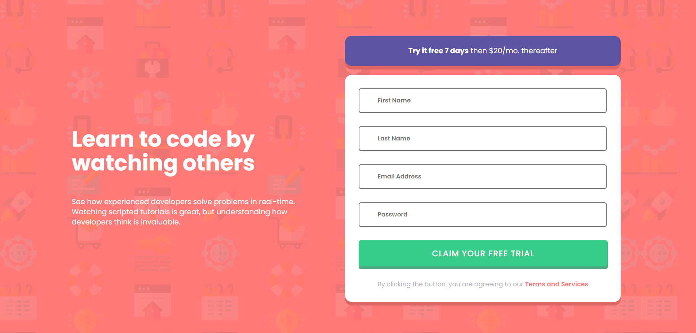

# Login Component
This is an example of a SignUp or LogIn component designed using HTML5/CSS3/JS with display or errors for not entering certain data in the fields.

[Click here to access the webpage!](https://celadon-swan-0aef27.netlify.app/)

The inspiration for the design of the website was heavily inspired by a [Frontend Mentor](www.frontendmentor.io) challenge.

# Screenshots
## Original State

## Error State

